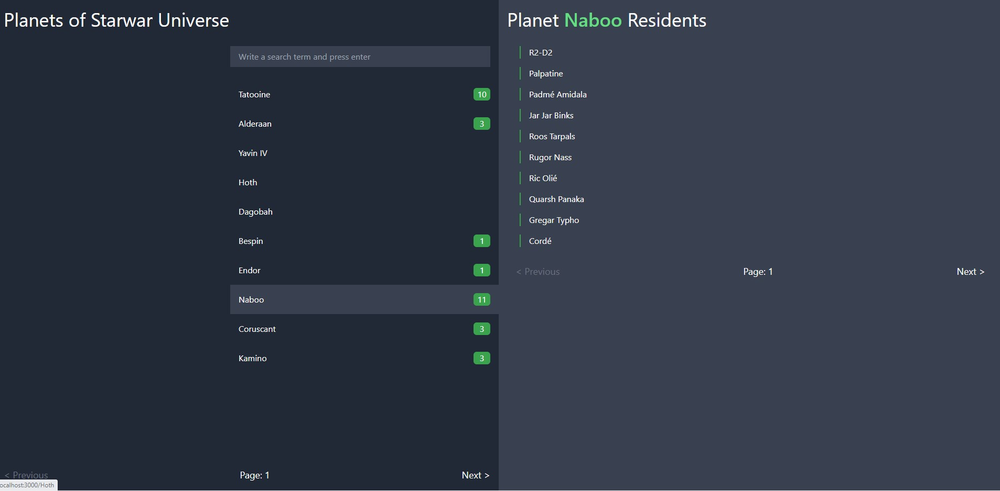

## This is a react project to search people from planets of star war univers.

### How to run the project?

- Download the source code or clone the repository
- go the source code directory
- run `npm install`
- run `npm run start`
- The application will be accessible at `localhost:3000`

### Accessibility

The application is accessible by using tab following normal tab indexing order of browser.

### Responsiveness

The application is responsive to the devices with different width.

### Technology and tools used

- react
- create-react-app
- Tailwindcss
- Redux
- LRU Cache
